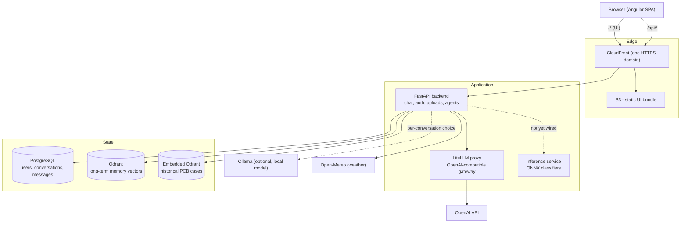
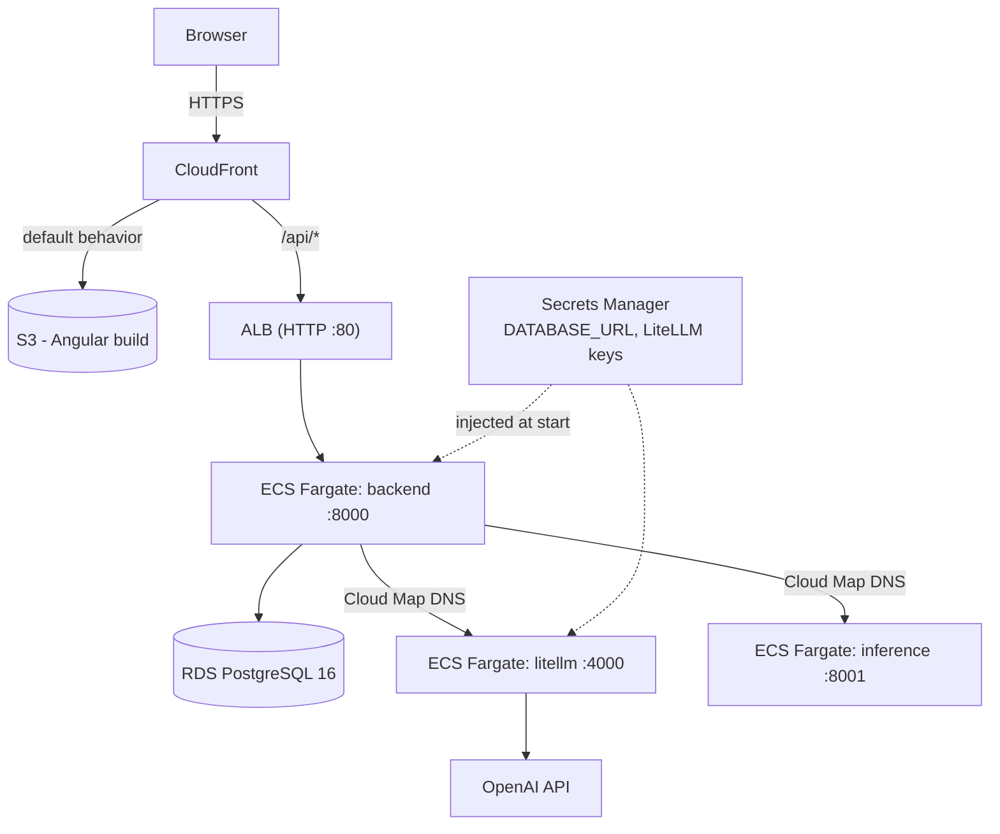

# SentinelChat - Architecture Overview

A high-level map of the system: what the pieces are, how a request flows through them, and how
it is deployed. For hands-on setup see [`ONBOARDING.md`](../ONBOARDING.md); for module-level
detail and gotchas see [`DEVELOPMENT.md`](../DEVELOPMENT.md).

---

## 1. What it is

SentinelChat is a ChatGPT-style assistant with a domain twist: alongside ordinary chat it can
diagnose **PCB (printed circuit board) inspection defects** from an attached image. It has:

- a streaming chat UI (Angular) over a FastAPI backend,
- a per-conversation choice of LLM provider (a local Ollama model, or OpenAI through a gateway),
- user accounts with roles, short-term (per-conversation) and long-term (cross-conversation) memory,
- mid-conversation tool calling (current time, weather, and PCB defect diagnosis),
- an **Explainability & Review Agent** - a multi-step LangGraph pipeline that grounds a defect
  call in retrieved history, visual evidence, and measurement telemetry,
- a standalone **inference service** that runs ONNX image classifiers.

---

## 2. System context



Solid lines are always-on paths; dotted lines are conditional or not yet connected.

---

## 3. Components

| Component | Tech | Responsibility |
|---|---|---|
| **UI** (`ui/`) | Angular, standalone components, signals | Chat interface, login/register, settings, image attach (paperclip or drag-drop), light/dark theme. Streams the assistant reply chunk by chunk. |
| **Backend** (`app/`) | FastAPI, SQLAlchemy async, Pydantic | The core service: auth, chat SSE streaming, conversation persistence, image uploads, tool-calling loop, the Explainability Agent, and a client for the inference service. **Stateless** - no request state shared between instances (except uploads on local disk today, a known gap). |
| **LiteLLM proxy** (`infra/litellm/`) | LiteLLM, OpenAI-compatible | The single egress point to OpenAI. The backend always talks to this, never `api.openai.com` directly, so real provider keys stay out of app config. Model aliases (`gpt-4o-mini`, `gpt-4o`, `text-embedding-3-small`) match what the app sends. |
| **Inference service** (`inference/`) | FastAPI, ONNX Runtime | Standalone image classification. `POST /classify` with a `model` name, `username`, and an image. Models are declared in `inference/models.toml` and their ONNX files baked into the image at build time. The backend client (`app/inference/`) exists but nothing calls it yet. |
| **PostgreSQL** | Postgres 16 | User accounts and auth, conversations and messages (short-term memory). Schema is Alembic-migrated (`alembic/`). |
| **Qdrant** | Qdrant | Long-term cross-conversation memory vectors. Accessed only through the `MemoryStore` interface, so the backing store can be swapped without touching callers. |
| **Embedded Qdrant** | file-based Qdrant under `data/images/qdrant_db/` | Historical PCB defect cases the Explainability Agent retrieves against. Separate from the Qdrant above; loaded lazily on first agent use. |

---

## 4. Key flows

### Authentication

Register (`POST /api/auth/register`) or log in (`POST /api/auth/login`) with a **username**, not
an email. The server issues a short-lived JWT **access token** plus a rotating, revocable
**refresh token**, both in `httpOnly` cookies. `POST /api/auth/refresh` mints a new pair.
Roles are QA, Operator, and Admin; the very first account ever created is forced to Admin as a
safety net (`scripts/create_admin_user.py` can also promote one). Chat requires being logged in.

### Chat streaming

1. UI sends `POST /api/chat/stream` with the message, any uploaded image ids, and the chosen
   provider.
2. The backend loads recent turns for that conversation from Postgres
   (`app/chat/history.py`, bounded by `CHAT_HISTORY_MAX_TURNS`) and, for a brand-new
   conversation, up to `MEMORY_RETRIEVAL_TOP_K` long-term memories into the system prompt.
3. It calls the selected provider (`get_chat_service()` factory -> `OllamaChatService` or
   `OpenAiChatService`) and relays the reply to the UI over Server-Sent Events
   (`event: delta` repeatedly, then `done`, or `error`).
4. The user message and the final assistant reply are persisted. Nothing in between is.

### Tool calling (within a chat turn)

When `CHAT_TOOL_CALLING_ENABLED` is on, the backend sends the registered tool specs
(`app/agents/registry.py`) to the provider and runs a bounded loop
(`CHAT_TOOL_MAX_ROUNDS`): if the model asks for a tool, the backend executes it via
`call_tool()` and feeds the result back, then streams the final answer. Registered tools:

- `current_time` - trivial.
- `get_weather` - the Weather Agent below.
- `explainability_review` - the agent below; only offered to the model when the message has an
  attached image, since the model cannot reference a real upload id on its own.

Disabling the kill switch sends no `tools` field at all, byte-identical to the pre-tool request.

### Long-term memory

Two tiers, both server-side and per account:

- **Short-term**: `Conversation` / `Message` rows in Postgres, replayed into context each reply.
- **Long-term**: every `MEMORY_EXTRACTION_INTERVAL_TURNS` assistant turns, `app/memory/service.py`
  runs an extra LLM call to pull durable facts out of the conversation and upserts them to
  Qdrant with an embedding. A new conversation retrieves the top matches back into its system
  prompt. `/remember <text>` saves one explicitly. `MEMORY_ENABLED` is a kill switch.

### Explainability & Review Agent

A LangGraph pipeline (`app/agents/explainability_review_agent/`), callable directly via
`POST /api/agents/explainability-review` or as a chat tool:

```
context_retrieval  ->  visual_evidence  ->  measurement_evidence  ->  reasoning
   (embedded Qdrant       (stub detector +      (ICT / 3D-AOI          (GPT-4o synthesis
    + IPC standards)       GPT-4o vision)        telemetry JSON)        + self-check)
```

It returns a defect category, a diagnosis, a grounding-confidence score, and whether the
self-check passed. The CLIP embedding model and the embedded Qdrant collection load lazily on
first use to keep startup and tests fast. `EXPLAINABILITY_AGENT_ENABLED` is its kill switch.
The `pcb_detector` node is a hardcoded stub carried over from the original prototype, not a real
object detector.

### Weather Agent

A smaller LangGraph pipeline (`app/agents/weather_agent/`), exposed only as the `get_weather`
chat tool:

```
geocode  ->  fetch_forecast  ->  (severe?) --yes-->  severe_advisory   --> END
                                          \--no --->  normal_advisory  --> END
```

`fetch_forecast` (Open-Meteo, no key) also runs a deterministic severe-weather check (thunderstorm/
heavy-precipitation WMO codes, or high wind) that decides which advisory node runs - a real
branch, not a cosmetic flag: the two nodes use different prompts and, on failure, different
templated fallback text. The advisory step itself is best-effort - it goes through the same
LiteLLM gateway as everything else (`OPENAI_BASE_URL`/`OPENAI_API_KEY`/`OPENAI_MODEL`) and
degrades to a templated summary (never an error) when `WEATHER_ADVISORY_ENABLED` is off, no key
is configured, or the LLM call fails.

### Inference service

Independent of the flows above. A caller (eventually the Explainability Agent) `POST`s an image
and a model name to the service; it runs that ONNX classifier and returns label + score. It
holds no state and has no database.

---

## 5. LLM access

Every OpenAI-compatible call - chat, memory fact-extraction, memory embeddings, and the agent's
GPT-4o reasoning and vision - goes through the LiteLLM proxy at `OPENAI_BASE_URL`. This gives
one place to add providers, swap models, or cap spend, and keeps real provider keys isolated to
one process.

| | Endpoint | Upstream OpenAI key |
|---|---|---|
| Local dev | LiteLLM container in the compose stack | **each developer's own**, in their git-ignored `.env` as `LITELLM_OPENAI_API_KEY` |
| Production | LiteLLM Fargate service, reached over private DNS | **one shared key** in AWS Secrets Manager |

Ollama (the "Local LLM" option) is a separate path - the backend calls it directly, no proxy,
no key. See [`infra/litellm/README.md`](../infra/litellm/README.md).

---

## 6. Environments

### Local (`infra/development/`)

`docker compose` runs Postgres, Qdrant, and the LiteLLM proxy; the backend runs from `uv` and
the UI from `npm start`. `ui` and `inference` are opt-in Compose profiles so a developer only
runs their slice. One setup script provisions everything - see [`ONBOARDING.md`](../ONBOARDING.md).

### Production (`infra/production/`, Terraform on AWS)



Notes:

- **One CloudFront distribution** serves both the UI (from S3) and `/api/*` (from the ALB), so
  everything is one HTTPS origin - no mixed content, no production CORS.
- Everything runs in the account's **default VPC public subnets** - no NAT Gateway, no custom
  domain yet. Security groups are the real boundary: each tier accepts traffic only from the
  tier in front of it (`internet -> ALB -> backend -> {RDS, inference, litellm}`).
- `litellm` and `inference` have **no public route** - the backend reaches them by Cloud Map
  private DNS (`*.sentinelchat.internal`).
- Backend and inference images live in **ECR**; the LiteLLM image is pulled from `ghcr.io`
  directly and its config is passed into the task definition (a model change is
  `terraform apply`, not an image build).
- Logs go to **CloudWatch** via the `awslogs` driver (`LOG_FORMAT=json` in prod). Terraform
  state lives in S3 with lockfile-based locking.

See [`infra/production/README.md`](../infra/production/README.md) for the deploy workflow.

---

## 7. Design principles

- **Stateless backend.** Horizontal scaling is a config change, not a rewrite. The one
  exception (chat image uploads on local disk) is a tracked gap.
- **Pure core interfaces + factories.** `app/core/` holds IO-free `Protocol`s
  (`ChatService`, `MemoryStore`, `Tool`, ...); a single factory constructs each concrete
  implementation. Swapping a provider or a vector store touches one file.
- **Kill switches over redeploys.** `MEMORY_ENABLED`, `CHAT_TOOL_CALLING_ENABLED`,
  `EXPLAINABILITY_AGENT_ENABLED` each turn a subsystem off without a code change.
- **Keys isolated to a gateway.** The app process never holds a real OpenAI key.
- **One HTTPS origin in production.** CloudFront fronts both UI and API.
- **Provisioned ahead of need.** Postgres and Qdrant were wired into infra before the features
  that use them landed, so those features deploy without an infra change.

---

## 8. Known limitations

- Chat image uploads are on local container disk, not S3 - blocks running more than one backend
  task.
- The backend does not call the inference service yet; wiring it into the Explainability Agent
  is the next step.
- The Explainability Agent's object-detection node is a stub, and its telemetry is synthetic.
- No custom domain or TLS certificate - CloudFront and the ALB use default AWS domains.
- LiteLLM auth is master-key-only (no per-consumer virtual keys or budgets yet).
- No autoscaling on any ECS service; each runs a single task.
- In production, the "Local LLM" (Ollama) option is not available - no Ollama instance is deployed.

---

## 9. Where to look next

| Doc | For |
|---|---|
| [`README.md`](../README.md) | product summary, dependency table |
| [`ONBOARDING.md`](../ONBOARDING.md) | exact dev environment setup |
| [`DEVELOPMENT.md`](../DEVELOPMENT.md) | module boundaries, branching/PR workflow, known gotchas |
| [`infra/litellm/README.md`](../infra/litellm/README.md) | the LLM gateway, per-dev vs prod keys |
| [`infra/production/README.md`](../infra/production/README.md) | AWS deploy workflow and rationale |
| [`inference/README.md`](../inference/README.md) | the inference service in detail |
| [`CHANGELOG.md`](../CHANGELOG.md) | what has shipped |
