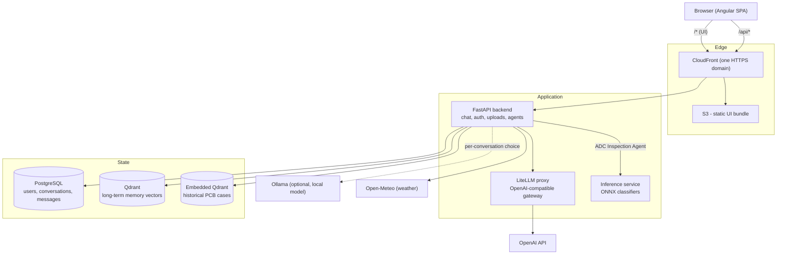
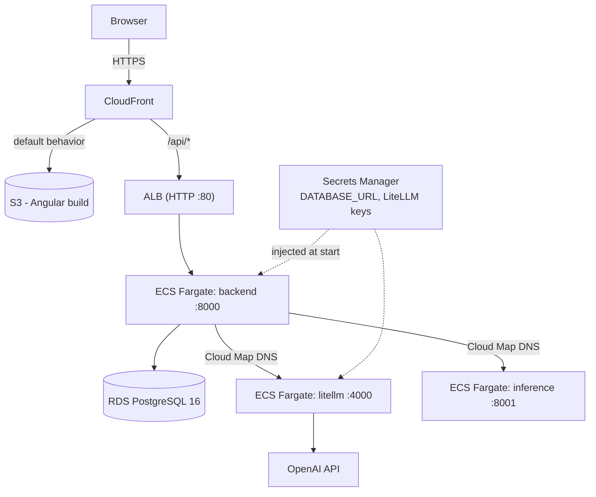

# SentinelChat - Architecture Overview

A high-level map of the system: what the pieces are, how a request flows through them, and how
it is deployed. For hands-on setup see [`ONBOARDING.md`](../ONBOARDING.md); for module-level
detail and gotchas see [`DEVELOPMENT.md`](../DEVELOPMENT.md).

---

## 1. What it is

SentinelChat is a ChatGPT-style assistant with a domain twist: alongside ordinary chat it can
diagnose **PCB (printed circuit board) inspection defects** from an attached image. It has:

- a streaming chat UI (Angular) over a FastAPI backend,
- a per-conversation choice of LLM provider (a local Ollama model, or OpenAI through a gateway),
- user accounts with roles, short-term (per-conversation) and long-term (cross-conversation) memory,
- mid-conversation tool calling (current time, weather, and PCB defect diagnosis),
- a **Case Review Agent** - a multi-step LangGraph pipeline that grounds a defect
  call in retrieved history, visual evidence, and measurement telemetry,
- a standalone **inference service** that runs ONNX image classifiers.

---

## 2. System context



Solid lines are always-on paths; dotted lines are conditional or not yet connected.

---

## 3. Components

| Component | Tech | Responsibility |
|---|---|---|
| **UI** (`ui/`) | Angular, standalone components, signals | Chat interface, login/register, settings, image attach (paperclip or drag-drop), light/dark theme. Streams the assistant reply chunk by chunk. |
| **Backend** (`app/`) | FastAPI, SQLAlchemy async, Pydantic | One service, organised as three independent feature modules over shared infrastructure - `app/chat/` (chat SSE streaming, conversation persistence, image uploads, the tool-calling loop and its agents, long-term memory), `app/workflow/` (the Work tab's bulk orchestrator and explainability-review agents), `app/modelops/` (the Models tab: model versions, drift reports, the retraining queue) and `app/shared/` (auth, config, DB base/session, the model-operations tables and rules, the inference-service client). See "Module boundaries" below. **Stateless** - no request state shared between instances (except uploads on local disk today, a known gap). |
| **LiteLLM proxy** (`infra/litellm/`) | LiteLLM, OpenAI-compatible | The single egress point to OpenAI. The backend always talks to this, never `api.openai.com` directly, so real provider keys stay out of app config. Model aliases (`gpt-4o-mini`, `gpt-4o`, `text-embedding-3-small`) match what the app sends. |
| **Inference service** (`inference/`) | FastAPI, ONNX Runtime | Standalone image classification. `POST /classify` with a `model` name, `username`, and an image. Models are declared in `inference/models.toml` and their ONNX files baked into the image at build time - currently the two-stage PCB ADC classifier (`pcb_region`, `pcb_body_defect`, `pcb_lead_defect`, `pcb_text_defect`). Called by the backend's ADC Inspection Agent via `app/shared/inference/`. |
| **PostgreSQL** | Postgres 16 | User accounts and auth, conversations and messages (short-term memory). Schema is Alembic-migrated (`alembic/`). |
| **Qdrant** | Qdrant | Long-term cross-conversation memory vectors. Accessed only through the `MemoryStore` interface, so the backing store can be swapped without touching callers. |
| **Embedded Qdrant** | file-based Qdrant under `data/images/qdrant_db/` | Historical PCB defect cases the Case Review Agent retrieves against. Separate from the Qdrant above; loaded lazily on first agent use. |

---

## 4. Key flows

### Authentication

Register (`POST /api/auth/register`) or log in (`POST /api/auth/login`) with a **username**, not
an email. The server issues a short-lived JWT **access token** plus a rotating, revocable
**refresh token**, both in `httpOnly` cookies. `POST /api/auth/refresh` mints a new pair.
Roles are QA, Operator, and Admin; the very first account ever created is forced to Admin as a
safety net (`scripts/create_admin_user.py` can also promote one). Chat requires being logged in.

### Chat streaming

1. UI sends `POST /api/chat/stream` with the message, any uploaded image ids, and the chosen
   provider.
2. The backend loads recent turns for that conversation from Postgres
   (`app/chat/services/history.py`, bounded by `CHAT_HISTORY_MAX_TURNS`) and, for a brand-new
   conversation, up to `MEMORY_RETRIEVAL_TOP_K` long-term memories into the system prompt.
3. It calls the selected provider (`get_chat_service()` factory -> `OllamaChatService` or
   `OpenAiChatService`) and relays the reply to the UI over Server-Sent Events
   (`event: delta` repeatedly, then `done`, or `error`).
4. The user message and the final assistant reply are persisted. Nothing in between is.

### Tool calling (within a chat turn)

When `CHAT_TOOL_CALLING_ENABLED` is on, the backend builds the registered tool specs
(`app/chat/agents/registry.py`), filtered by `_available_tool_specs()` (`app/chat/services/streaming.py`) and by role (`app/chat/agents/access.py`). Registered tools:

- `current_time` - the Time Agent below.
- `get_weather` - the Weather Agent below.
- `explainability_review` - the Case Review Agent below; only offered when the message has an
  attached image, since the model cannot reference a real upload id on its own.
- `inspect_image` - the Inspection Agent below; same image-attached gating.
- `find_similar_cases`, `get_case`, `list_cases`, `review_case`, `investigate_case` - the Case Agent;
  they work from a case number (or the latest case in the conversation), so no image is needed.
- `flag_case_for_retraining`, `report_model_drift`, `get_drift_summary`, `draft_retraining_plan` -
  the Monitoring Agent's model-health tools; `monitoring_status` (its overview) is Admin-only.

The Work tab's agents are deliberately **not** among these - see "Work tab" below.

Disabling the kill switch sends no `tools` field at all, byte-identical to the pre-tool request.

If `INTENT_ROUTER_ENABLED` is also on and at least one tool is on offer, the Intent Router (below)
runs first and either narrows `tools` down to its single pick (or clears it, for "no tool
needed") or, below `INTENT_ROUTER_CONFIDENCE_THRESHOLD`, short-circuits the turn with a
clarifying question instead of calling the provider at all. Otherwise every filtered tool is
offered and the provider picks, exactly as before the router existed.

Either way, the backend then runs a bounded loop (`CHAT_TOOL_MAX_ROUNDS`): if the model asks for
a tool, the backend executes it via `call_tool()` and feeds the result back, then streams the
final answer.

### Long-term memory

Two tiers, both server-side and per account:

- **Short-term**: `Conversation` / `Message` rows in Postgres, replayed into context each reply.
- **Long-term**: every `MEMORY_EXTRACTION_INTERVAL_TURNS` assistant turns, `app/chat/memory/service.py`
  runs an extra LLM call to pull durable facts out of the conversation and upserts them to
  Qdrant with an embedding. A new conversation retrieves the top matches back into its system
  prompt. `/remember <text>` saves one explicitly. `MEMORY_ENABLED` is a kill switch.

### Case Review Agent

A LangGraph pipeline (`app/chat/agents/case_agent/`, formerly `explainability_review_agent/`),
callable directly via `POST /api/agents/explainability-review` or as a chat tool:

```
context_retrieval  ->  visual_evidence  ->  measurement_evidence  ->  reasoning
   (embedded Qdrant       (stub detector +      (ICT / 3D-AOI          (GPT-4o synthesis
    + IPC standards)       GPT-4o vision)        telemetry JSON)        + self-check)
```

It returns a defect category, a diagnosis, a grounding-confidence score, and whether the
self-check passed. The CLIP embedding model and the embedded Qdrant collection load lazily on
first use to keep startup and tests fast. `EXPLAINABILITY_AGENT_ENABLED` is its kill switch.
The `pcb_detector` node is a hardcoded stub carried over from the original prototype, not a real
object detector. Renamed to free up the "explainability and review" name for a second, unrelated
agent below that took it instead.

### Explainability Review Agent

A different LangGraph pipeline (`app/workflow/src/agent2_explainability/`), dropped in as-is from a
separate standalone prototype (`pcb_agentic_inspector`'s "Agent 2") and unrelated to the Case
Review Agent above despite the similar name. Never a chat tool, and **currently unwired**: the
Work tab's orchestrator agent (`src/agent1_orchestrator/`) is constructed with `enable_a2a=False`
(`app/workflow/services/streaming.py`), so nothing calls into this pipeline yet - a REVIEW_REQUIRED
sample stays REVIEW_REQUIRED. `explainability_review_agent_enabled` (`settings.py`) is a leftover
kill switch nothing currently reads; wiring this agent back in is the natural next step and should
consult it. When it does run:

```
retrieve_precedents  ->  extract_telemetry  ->  inspect_visuals  ->  grounding_self_check
  (hardcoded mock         (AOI measurement       (local Ollama          (GPT-4o reasoning,
   IPC precedents)         flattening)             LLaVA VLM)            heuristic fallback)
```

Configured by its own `config/agent2_config.yaml` (kept as-is, not routed through
`app/shared/config/settings.py`) and a direct `OPENAI_API_KEY` env var read, rather than this app's usual
`settings.openai_api_key`/LiteLLM-proxy convention - a deliberate exception, since it was dropped
in unchanged rather than adapted.

### Weather Agent

A smaller LangGraph pipeline (`app/chat/agents/weather_agent/`), exposed only as the `get_weather`
chat tool:

```
geocode  ->  fetch_forecast  ->  (severe?) --yes-->  severe_advisory   --> END
                                          \--no --->  normal_advisory  --> END
```

`fetch_forecast` (Open-Meteo, no key) also runs a deterministic severe-weather check (thunderstorm/
heavy-precipitation WMO codes, or high wind) that decides which advisory node runs - a real
branch, not a cosmetic flag: the two nodes use different prompts and, on failure, different
templated fallback text. The advisory step itself is best-effort - it goes through the same
LiteLLM gateway as everything else (`OPENAI_BASE_URL`/`OPENAI_API_KEY`/`OPENAI_MODEL`) and
degrades to a templated summary (never an error) when `WEATHER_ADVISORY_ENABLED` is off, no key
is configured, or the LLM call fails.

### Time Agent

The smallest LangGraph pipeline (`app/chat/agents/time_agent/`), exposed only as the `current_time`
chat tool:

```
resolve_timezone  ->  compute_time  ->  (business hours?) --yes-->  business_hours  --> END
                                                           \--no --->  after_hours  --> END
```

`resolve_timezone` geocodes an optional location (the same Open-Meteo endpoint the Weather Agent
uses, and no key either) to an IANA timezone, or uses UTC if no location was given.
`compute_time` runs a deterministic weekday/hour check that decides which branch runs - a real
branch again, just a plain check this time. **No LLM step anywhere in this one** - unlike the
other two agents, "what time is it" is fully structured, so there's nothing an LLM would add
besides latency and cost.

### Inspection Agent

`app/chat/agents/inspection_agent/`, exposed as the `inspect_image` chat tool, inspects **one
image** per call in two stages. First an LLM-driven ReAct pass (`react.py`) works the inspection
steps as tools (verify, golden lookup, XML validation, alignment, region and defect classification,
list live models); every step it asks for is checked by the same PolicyEngine the planner uses, and
it closes with a plain-language summary. Then the deterministic pipeline (`graph.py`) resumes from
whatever state the LLM left: it runs any skipped step, applies the confidence/measurement/alignment
rules to reach a verdict, and persists the Case. The LLM never sees image bytes or ids and never
decides the verdict, so a failed or confused LLM run only costs time (and without an OpenAI key the
first stage is simply skipped). The pipeline:

```
verify image -> golden-image lookup -> validate inspection XML -> alignment/quality check
   -> classify_region -> classify_defect -> verdict -> persist a Case
```

A deterministic Planner proposes each next step and a PolicyEngine validates it before dispatch;
a rejection aborts rather than looping. Region and defect classification call the inference
service (`pcb_region`, then `pcb_body_defect` / `pcb_lead_defect` / `pcb_text_defect`). Every run
is persisted as a `Case` (ACCEPTED or REVIEW_REQUIRED) stamped with the model versions that
answered. `ADC_INSPECTION_AGENT_ENABLED` is its kill switch; `INSPECTION_AGENT_LLM_ENABLED` turns
off just the LLM stage. REVIEW_REQUIRED is terminal: the agent never calls another agent (chat agents are
independent, enforced by `tests/chat/test_agent_boundaries.py`); a deeper diagnosis is requested
from the Case Review Agent by case number. Not to be confused with the Work tab's bulk
Orchestrator agent (`OrchestratorAgent`) below.

### Models tab (`app/modelops/`)

Backend for the Models tab: which version of each model is live, drift reports, and the retraining
queue. The app's database is the record (`model_versions`, `drift_reports`, `retraining_jobs`,
`retraining_tickets`); the inference service holds no durable state - it reports what it has loaded
and runs jobs. Opening the tab (`GET /api/models`) syncs versions from it, and reading the queue
refreshes queued/running jobs; if the service is unreachable the tab shows last-known data and says
so, and a job it no longer remembers (jobs are in its memory only) is failed and its tickets
released for a new plan.

The flow: chat agents flag cases and draft a plan (`pending_approval`) - they can do nothing more.
An Admin approves it in the tab, which sends it to the inference service (a failed send leaves it
`approved` with the reason, retryable; the service dedupes on our job id). When the job succeeds its
weights are registered as a `candidate` version, and an Admin promotes it (the service downloads,
loads and smoke-tests it before swapping, so a bad file leaves the current model serving) or rolls
back. Training itself is a stub for now: it produces no new weights and is marked `simulated`.

The UI counterpart is `ui/src/app/models/` (the third tab beside Chat and Work): live model
versions and their history, drift reports, and the retraining queue with progress. It polls while
any job is queued or running, flags a stale view when the inference service is unreachable, and
labels a simulated run as such rather than as an improved model. Approve, promote, roll back,
resolve and cancel are shown to Admins only (a QA user can withdraw a plan they drafted); the
backend enforces the same rules.

### Work tab (`app/workflow/`)

The Work tab's agents live in their own module and are unreachable from the chat tool-calling
loop: `app/workflow/` never imports `app/chat/`, and nothing in chat imports it.

- **Orchestrator agent** (`src/agent1_orchestrator/`): a close-to-verbatim drop-in of
  `pcb_agentic_inspector`'s Agent 1, the *bulk* workflow - a CSV dataset plus inspection XML and an
  optional image root, in three modes (`prepare`, `prepare_verify`, `run_full`). `run_full` runs a
  Planner -> PolicyEngine -> execute -> replan loop over every sample; its `OrchestratorAgent.run()`
  is synchronous (not an async generator) and gained one additive `on_step` callback so
  `app/workflow/services/streaming.py` can still stream progress live over SSE while running it in
  a worker thread. Served at `POST /api/orchestrator/run/stream` (SSE) with its own
  `/api/orchestrator/uploads/*` endpoints, QA/Admin only; `ORCHESTRATOR_AGENT_ENABLED` is its kill
  switch. Model serving goes through the `inference/` microservice, not local ONNX files - see
  `app/workflow/INTEGRATION_NOTES.md`.
- **Explainability Review Agent** (`src/agent2_explainability/`): described above; present in the
  drop-in but currently unwired (`enable_a2a=False`) - a REVIEW_REQUIRED sample stays
  REVIEW_REQUIRED rather than escalating further, for now.
- `api/` and `services/` hold this repo's own app-side glue (SSE run streaming, upload storage,
  request schemas, drift/retraining-ticket routes) around the drop-in. The drop-in itself
  (`src/`, plus sibling top-level `planner/`, `state/`, `verification/`, `adc_shared/`) is kept
  unformatted and untyped on purpose so diffs against upstream stay legible (excluded from ruff,
  mypy `exclude`) - see `app/workflow/INTEGRATION_NOTES.md` for what was changed from the raw
  drop-in and why.

### Intent Router

A one-node LangGraph pipeline (`app/chat/agents/router_agent/`) that runs ahead of the tool-calling
loop described above - not itself a registered tool, since it decides which tools (if any) get
offered in the first place rather than being one the model can call. One LLM call picks the
single best-matching tool by name (or `null` for "just answer, no tool needed") with a confidence
score, or returns a `clarifying_question` when the request plausibly matches more than one tool
or doesn't give enough detail to tell. `INTENT_ROUTER_ENABLED` is its kill switch; any failure
(no key configured, nothing to route among, an upstream error) fails open to "offer every tool,
no clarification" rather than blocking the turn.

### Inference service

Called by both the ADC Inspection Agent (chat) and the Work tab's orchestrator agent. A caller `POST`s an image and a model name to the
service; it runs that ONNX classifier and returns label + score. It holds no state and has no
database.

---

## 5. LLM access

Every OpenAI-compatible call - chat, memory fact-extraction, memory embeddings, and the agent's
GPT-4o reasoning and vision - goes through the LiteLLM proxy at `OPENAI_BASE_URL`. This gives
one place to add providers, swap models, or cap spend, and keeps real provider keys isolated to
one process.

| | Endpoint | Upstream OpenAI key |
|---|---|---|
| Local dev | LiteLLM container in the compose stack | **each developer's own**, in their git-ignored `.env` as `LITELLM_OPENAI_API_KEY` |
| Production | LiteLLM Fargate service, reached over private DNS | **one shared key** in AWS Secrets Manager |

Ollama (the "Local LLM" option) is a separate path - the backend calls it directly, no proxy,
no key. See [`infra/litellm/README.md`](../infra/litellm/README.md).

---

## 6. Environments

### Local (`infra/development/`)

`docker compose` runs Postgres, Qdrant, and the LiteLLM proxy; the backend runs from `uv` and
the UI from `npm start`. `ui` and `inference` are opt-in Compose profiles so a developer only
runs their slice. One setup script provisions everything - see [`ONBOARDING.md`](../ONBOARDING.md).

### Production (`infra/production/`, Terraform on AWS)



Notes:

- **One CloudFront distribution** serves both the UI (from S3) and `/api/*` (from the ALB), so
  everything is one HTTPS origin - no mixed content, no production CORS.
- Everything runs in the account's **default VPC public subnets** - no NAT Gateway, no custom
  domain yet. Security groups are the real boundary: each tier accepts traffic only from the
  tier in front of it (`internet -> ALB -> backend -> {RDS, inference, litellm}`).
- `litellm` and `inference` have **no public route** - the backend reaches them by Cloud Map
  private DNS (`*.sentinelchat.internal`).
- Backend and inference images live in **ECR**; the LiteLLM image is pulled from `ghcr.io`
  directly and its config is passed into the task definition (a model change is
  `terraform apply`, not an image build).
- Logs go to **CloudWatch** via the `awslogs` driver (`LOG_FORMAT=json` in prod). Terraform
  state lives in S3 with lockfile-based locking.

See [`infra/production/README.md`](../infra/production/README.md) for the deploy workflow.

---

## 7. Design principles

- **Stateless backend.** Horizontal scaling is a config change, not a rewrite. The one
  exception (chat image uploads on local disk) is a tracked gap.
- **Module boundaries.** `app/chat/`, `app/workflow/` and `app/modelops/` are independent; each may
  import `app/shared/`, and none may import another (`tests/test_module_boundaries.py` enforces it,
  including lazy imports). Each module owns its own `api/`, `agents/`, `services/`, `core/` and
  `db/` as needed; anything two need moves to `shared` - which is why the model-operations tables
  and rules live there (chat's monitoring agent drafts plans; modelops's Admin routes approve and
  run them). `app/main.py` is the only place that knows all of them.
- **Pure core interfaces + factories.** `app/chat/core/` holds IO-free `Protocol`s
  (`ChatService`, `MemoryStore`, `Tool`); a single factory constructs each concrete
  implementation. Swapping a provider or a vector store touches one file.
- **Kill switches over redeploys.** `MEMORY_ENABLED`, `CHAT_TOOL_CALLING_ENABLED`,
  `EXPLAINABILITY_AGENT_ENABLED`, `ADC_INSPECTION_AGENT_ENABLED`, `ORCHESTRATOR_AGENT_ENABLED`,
  `INTENT_ROUTER_ENABLED` each
  turn a subsystem off without a code change.
- **Keys isolated to a gateway.** The app process never holds a real OpenAI key.
- **One HTTPS origin in production.** CloudFront fronts both UI and API.
- **Provisioned ahead of need.** Postgres and Qdrant were wired into infra before the features
  that use them landed, so those features deploy without an infra change.

---

## 8. Known limitations

- Chat image uploads are on local container disk, not S3 - blocks running more than one backend
  task.
- The Case Review Agent's object-detection node is a stub, and its telemetry is synthetic -
  `JcProg/PCBInspect-AI` (object detection, on the same HF org as the ADC classifiers) is a
  plausible real replacement, not yet wired in.
- The batch/dataset workflow is not a chat tool by design: it lives in the Work tab's
  `orchestrator_agent` behind its own routes. The chat-side ADC Inspection Agent only handles one
  image (plus optional XML) per call.
- No custom domain or TLS certificate - CloudFront and the ALB use default AWS domains.
- LiteLLM auth is master-key-only (no per-consumer virtual keys or budgets yet).
- No autoscaling on any ECS service; each runs a single task.
- In production, the "Local LLM" (Ollama) option is not available - no Ollama instance is deployed.

---

## 9. Where to look next

| Doc | For |
|---|---|
| [`README.md`](../README.md) | product summary, dependency table |
| [`ONBOARDING.md`](../ONBOARDING.md) | exact dev environment setup |
| [`DEVELOPMENT.md`](../DEVELOPMENT.md) | module boundaries, branching/PR workflow, known gotchas |
| [`infra/litellm/README.md`](../infra/litellm/README.md) | the LLM gateway, per-dev vs prod keys |
| [`infra/production/README.md`](../infra/production/README.md) | AWS deploy workflow and rationale |
| [`inference/README.md`](../inference/README.md) | the inference service in detail |
| [`CHANGELOG.md`](../CHANGELOG.md) | what has shipped |
