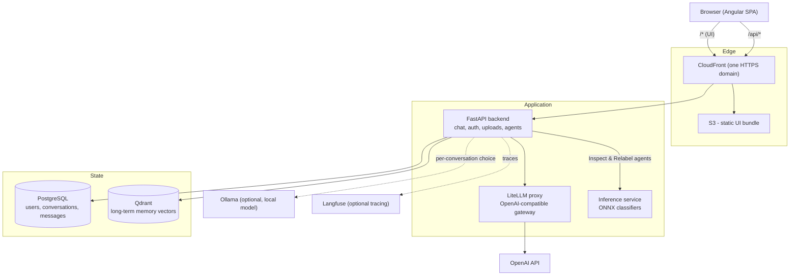
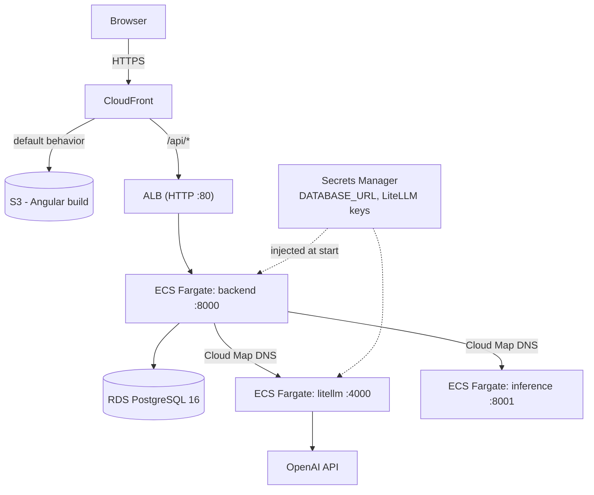

# SentinelChat - Architecture Overview

A high-level map of the system: what the pieces are, how a request flows through them, and how
it is deployed. For hands-on setup see [`ONBOARDING.md`](../ONBOARDING.md); for module-level
detail and gotchas see [`DEVELOPMENT.md`](../DEVELOPMENT.md).

---

## 1. What it is

SentinelChat is a ChatGPT-style assistant with a domain twist: alongside ordinary chat it can
diagnose **PCB (printed circuit board) inspection defects** from an attached image. It has:

- a streaming chat UI (Angular) over a FastAPI backend,
- a per-conversation choice of LLM provider (a local Ollama model, or OpenAI through a gateway),
- user accounts with roles, short-term (per-conversation) and long-term (cross-conversation) memory,
- mid-conversation tool calling over several agents - an **inspect agent** that classifies an
  uploaded image and shows the result (a Case is only created if the user asks for one), a
  **sample agent** that looks up what the Work tab stored about a dataset sample, a **relabel agent** that records a QA's correction of a
  wrong label for retraining, and a **monitoring agent** for model drift,
- a standalone **inference service** that runs ONNX image classifiers.

---

## 2. System context


```mermaid
flowchart TD
    browser["Browser (Angular SPA)"]

    subgraph edge["Edge"]
        cf["CloudFront (one HTTPS domain)"]
        s3["S3 - static UI bundle"]
    end

    subgraph app["Application"]
        be["FastAPI backend<br/>chat, auth, uploads, agents"]
        lite["LiteLLM proxy<br/>OpenAI-compatible gateway"]
        inf["Inference service<br/>ONNX classifiers"]
    end

    subgraph data["State"]
        pg[("PostgreSQL<br/>users, conversations, messages")]
        qd[("Qdrant<br/>long-term memory vectors")]
    end

    openai["OpenAI API"]
    ollama["Ollama (optional, local model)"]
    langfuse["Langfuse (optional tracing)"]

    browser -->|"/* (UI)"| cf --> s3
    browser -->|"/api/*"| cf --> be
    be --> pg
    be --> qd
    be --> lite --> openai
    be -.->|per-conversation choice| ollama
    be -->|Inspect & Relabel agents| inf
    be -.->|traces| langfuse
```

Solid lines are always-on paths; dotted lines are conditional or not yet connected.

---

## 3. Components

| Component | Tech | Responsibility |
|---|---|---|
| **UI** (`ui/`) | Angular, standalone components, signals | Chat interface, login/register, settings, image attach (paperclip or drag-drop), light/dark theme. Streams the assistant reply chunk by chunk. |
| **Backend** (`app/`) | FastAPI, SQLAlchemy async, Pydantic | One service, organised as three independent feature modules over shared infrastructure - `app/chat/` (chat SSE streaming, conversation persistence, image uploads, the tool-calling loop and its agents, long-term memory), `app/workflow/` (the Work tab's bulk orchestrator and explainability-review agents), `app/modelops/` (the Models tab: model versions, drift reports, the retraining queue) and `app/shared/` (auth, config, DB base/session, the model-operations tables and rules, the inference-service client). See "Module boundaries" below. **Stateless** - no request state shared between instances (except uploads on local disk today, a known gap). |
| **LiteLLM proxy** (`infra/litellm/`) | LiteLLM, OpenAI-compatible | The single egress point to OpenAI. The backend always talks to this, never `api.openai.com` directly, so real provider keys stay out of app config. Model aliases (`gpt-4o-mini`, `gpt-4o`, `text-embedding-3-small`) match what the app sends. |
| **Inference service** (`inference/`) | FastAPI, ONNX Runtime | Standalone image classification. `POST /classify` with a `model` name, `username`, and an image. Models are declared in `inference/models.toml` and their ONNX files baked into the image at build time - currently the two-stage PCB ADC classifier (`pcb_region`, `pcb_body_defect`, `pcb_lead_defect`, `pcb_text_defect`). Called by the backend's ADC Inspection Agent via `app/shared/inference/`. |
| **PostgreSQL** | Postgres 16 | User accounts and auth, conversations and messages (short-term memory). Schema is Alembic-migrated (`alembic/`). |
| **Qdrant** | Qdrant | Long-term cross-conversation memory vectors. Accessed only through the `MemoryStore` interface, so the backing store can be swapped without touching callers. The Work tab also keeps its run/review/decision records here, as payload-only collections (`adc_*`, no vectors) via `app/workflow/services/run_store.py`. |

---

## 4. Key flows

### Authentication

Register (`POST /api/auth/register`) or log in (`POST /api/auth/login`) with a **username**, not
an email. The server issues a short-lived JWT **access token** plus a rotating, revocable
**refresh token**, both in `httpOnly` cookies. `POST /api/auth/refresh` mints a new pair.
Roles are QA, Operator, and Admin; the very first account ever created is forced to Admin as a
safety net (`scripts/create_admin_user.py` can also promote one). Chat requires being logged in.

### Chat streaming

1. UI sends `POST /api/chat/stream` with the message, any uploaded image ids, and the chosen
   provider.
2. The backend loads recent turns for that conversation from Postgres
   (`app/chat/services/history.py`, bounded by `CHAT_HISTORY_MAX_TURNS`) and, for a brand-new
   conversation, up to `MEMORY_RETRIEVAL_TOP_K` long-term memories into the system prompt.
3. It hands the reply to the supervisor agent (`app/chat/agents/supervisor.py`, a LangGraph
   agent over the conversation's chosen model - `build_chat_model("ollama"|"openai")`) and relays
   what it does over Server-Sent Events: `event: delta` for reply text, `tool_call` / `tool_result`
   around tools, then `done` (or `error`).
4. The user message and the final assistant reply are persisted. Nothing in between is.

### Tool calling (within a chat turn)

When `CHAT_TOOL_CALLING_ENABLED` is on, the supervisor is given the tools this request may use
(`tool_registry.available()` in `app/chat/agents/registry.py`: switched on, permitted for the role in
`app/chat/agents/access.py`, and - for `inspect_image` - an image attached). The chat model is the
**supervisor**: it picks among the three agents' tools and writes the answer. Registered tools:

- `inspect_image` - the Inspect Agent below; only offered when the message has an attached image,
  since the model cannot reference a real upload id on its own. It saves nothing; `create_case`
  (offered always, no image needed) turns the inspection into a Case once the user has said yes in
  a later turn.
- `get_sample`, `list_review_cases` - the Sample Agent: read-only views of the Work tab's stored
  runs (Qdrant), looked up by the dataset's `sample_id`.
- `relabel_case`, `confirm_relabel` - the Relabel Agent below; they work from a case number (or the
  latest case in the conversation), so no image is needed.
- `get_drift_summary`, `report_model_drift`, `draft_retraining_plan` - the Monitoring Agent's
  model-health tools; `monitoring_status` (its overview) is Admin-only.

The Work tab's agents are deliberately **not** among these - see "Work tab" below.

Disabling the kill switch gives the model no tools at all.

Each tool is a LangChain `@tool` (`app/chat/agents/toolkit.py`): the model sees its docstring and
the arguments it may supply, and LangGraph additionally injects a `ToolContext` (session, user,
conversation, attached upload ids) the model never sees - so the model can never supply the user or
an upload. A tool the request may not use is simply not given to the model, so it cannot be run. The
loop is bounded by `CHAT_TOOL_MAX_ROUNDS` (LangGraph's recursion limit); past it the user gets an
apology instead of an answer.
Around each call it emits two SSE frames besides `delta`: `event: tool_call` (`{name, label}`, so
the UI can say "Calling Image inspection...") before it runs, and - for `inspect_image`,
`relabel_case` and `confirm_relabel` - `event: tool_result` with the tool's structured result
afterwards, which the UI renders as a card (`ui/src/app/chat/tool-result-card/`) so the user sees
the exact numbers rather than only the model's retelling. Neither frame is persisted.

### Long-term memory

Two tiers, both server-side and per account:

- **Short-term**: `Conversation` / `Message` rows in Postgres, replayed into context each reply.
- **Long-term**: every `MEMORY_EXTRACTION_INTERVAL_TURNS` assistant turns, `app/chat/memory/service.py`
  runs an extra LLM call to pull durable facts out of the conversation and upserts them to
  Qdrant with an embedding. A new conversation retrieves the top matches back into its system
  prompt. `/remember <text>` saves one explicitly. `MEMORY_ENABLED` is a kill switch.

### Explainability Review Agent

A different LangGraph pipeline (`app/workflow/src/agent2_explainability/`), dropped in as-is from a
separate standalone prototype (`pcb_agentic_inspector`'s "Agent 2") and unrelated to the
chat agents despite the similar names. Never a chat tool, and **currently unwired**: the
Work tab's orchestrator agent (`src/agent1_orchestrator/`) is constructed with `enable_a2a=False`
(`app/workflow/services/streaming.py`), so nothing calls into this pipeline yet - a REVIEW_REQUIRED
sample stays REVIEW_REQUIRED. `explainability_review_agent_enabled` (`settings.py`) is a leftover
kill switch nothing currently reads; wiring this agent back in is the natural next step and should
consult it. When it does run:

```
retrieve_precedents  ->  extract_telemetry  ->  inspect_visuals  ->  grounding_self_check
  (hardcoded mock         (AOI measurement       (local Ollama          (GPT-4o reasoning,
   IPC precedents)         flattening)             LLaVA VLM)            heuristic fallback)
```

Configured by its own `config/agent2_config.yaml` (kept as-is, not routed through
`app/shared/config/settings.py`) and a direct `OPENAI_API_KEY` env var read, rather than this app's usual
`settings.openai_api_key`/LiteLLM-proxy convention - a deliberate exception, since it was dropped
in unchanged rather than adapted.

### Inspect Agent

`app/chat/agents/inspection_agent/`, exposed as the `inspect_image` and `create_case` chat tools: a
QA/Admin attaches **one image** (optionally an inspection XML) and gets the inference result. Built from sub-agents,
each callable on its own:

```
verifier           classifier                      verdict            pipeline
 readable image?    pcb_region                      ACCEPTED /         parks a draft Case,
 validate XML       -> pcb_body|lead|text_defect    REVIEW_REQUIRED    stamped with the model
 measurements       (inference service)             + every reason     versions that answered
```

On top sits an LLM-driven **ReAct pass** (`react.py`, LangChain `create_agent` on LangGraph): the
inspection steps are its tools (plus read-only `get_scores`, `check_image_quality`, `list_models`);
it chooses the order and writes a short summary. Every step it asks for passes `policy.py` - the
same step-order rules the deterministic path uses - so an out-of-order call is refused with the
reason. **The LLM never decides the verdict or saves anything**: afterwards `pipeline._complete` runs
any step it skipped, `verdict.decide` applies fixed confidence/measurement rules, and the result is
parked as a draft (`inspection_drafts`). A failed or confused LLM run therefore only costs time, and without an OpenAI key (or with
`INSPECTION_AGENT_LLM_ENABLED` off) the pipeline runs unassisted. An inference-service outage is an
error with no draft, not a case parked in review. **No Case is saved by `inspect_image`**: a Case is
what a user relabels or reviews, so the agent asks whether they want one, and `create_case` (no
arguments - it saves exactly what was inspected) creates it only in a *later* chat turn than the
inspection (`app/chat/services/confirmation.py`, enforced in code). `ADC_INSPECTION_AGENT_ENABLED`
is its kill switch.
Not to be confused with the Work tab's bulk Orchestrator agent below.

### Relabel Agent

`app/chat/agents/relabel_agent/`: the QA says the model's defect label on a Case is wrong and gives
the right one. A relabel is two chat turns, so two tools:

```
relabel_case (propose)                         confirm_relabel (commit, a LATER turn)
 resolver  - which Case (number, or latest)     recorder - sets corrected_label/by/at/why on the
 labels    - is it a class the model can          Case (the model's own defect_label is kept)
             output? (inference service,          and queues the RetrainingTicket, atomically
             fails closed)
 recorder  - park the proposal on the Case
```

The confirm step is **enforced in code, not by the prompt**: `streaming.py` injects when the turn
began, and `service.py` refuses to commit a proposal stamped inside that same turn, or one made by
another user - so the model cannot propose and confirm in one breath. Corrections also feed drift
(`correction_rate` in `app/chat/services/drift.py`). `RELABEL_AGENT_ENABLED` is its kill switch.

### Monitoring Agent

`app/chat/agents/monitoring_agent/`: `get_drift_summary` compares a model's recent window with the one
before (review rate, reviewer override rate, correction rate, low-confidence share, mean confidence,
per model version); `report_model_drift` files a drift report with that snapshot;
`draft_retraining_plan` turns the model's open tickets into a `RetrainingJob` in `pending_approval`.
Nothing here retrains or promotes - see the Models tab below. `MONITORING_AGENT_ENABLED` and
`MODELOPS_ENABLED` gate it.

### LLM and tracing

Every chat model is built in one place, `app/shared/config/llm.py`: the conversation's choice
(`build_chat_model("ollama"|"openai")`) for the supervisor and memory's fact extraction, and the
agents' own from `AGENT_LLM_PROVIDER` / `AGENT_LLM_MODEL` for the inspect agent's ReAct pass (blank
model falls back to the provider's chat model). `openai` goes through the LiteLLM gateway. Every model
logs its requests and responses at DEBUG. Changing model - or provider, with its `langchain-<name>` package installed - is a
setting. With `LANGFUSE_ENABLED` and keys set (`app/shared/config/langfuse.py`), each inspection is
one trace with every model and tool call nested under it, attributed to the user and conversation;
off or unconfigured, it degrades to no tracing. The supervisor's turn is traced the same way, with
the user and conversation attached.

### Models tab (`app/modelops/`)

Backend for the Models tab: which version of each model is live, drift reports, and the retraining
queue. The app's database is the record (`model_versions`, `drift_reports`, `retraining_jobs`,
`retraining_tickets`); the inference service holds no durable state - it reports what it has loaded
and runs jobs. Opening the tab (`GET /api/models`) syncs versions from it, and reading the queue
refreshes queued/running jobs; if the service is unreachable the tab shows last-known data and says
so, and a job it no longer remembers (jobs are in its memory only) is failed and its tickets
released for a new plan.

The flow: chat agents queue relabel tickets and draft a plan (`pending_approval`) - they can do nothing more.
An Admin approves it in the tab, which sends it to the inference service (a failed send leaves it
`approved` with the reason, retryable; the service dedupes on our job id). When the job succeeds its
weights are registered as a `candidate` version, and an Admin promotes it (the service downloads,
loads and smoke-tests it before swapping, so a bad file leaves the current model serving) or rolls
back. Training itself is a stub for now: it produces no new weights and is marked `simulated`.

The UI counterpart is `ui/src/app/models/` (the third tab beside Chat and Work): live model
versions and their history, drift reports, and the retraining queue with progress. It polls while
any job is queued or running, flags a stale view when the inference service is unreachable, and
labels a simulated run as such rather than as an improved model. Approve, promote, roll back,
resolve and cancel are shown to Admins only (a QA user can withdraw a plan they drafted); the
backend enforces the same rules.

### Work tab (`app/workflow/`)

The Work tab's agents live in their own module and are unreachable from the chat tool-calling
loop: `app/workflow/` never imports `app/chat/`, and nothing in chat imports it.

- **Orchestrator agent** (`src/agent1_orchestrator/`): a close-to-verbatim drop-in of
  `pcb_agentic_inspector`'s Agent 1, the *bulk* workflow - a CSV dataset plus inspection XML and an
  optional image root, in three modes (`prepare`, `prepare_verify`, `run_full`). `run_full` runs a
  Planner -> PolicyEngine -> execute -> replan loop over every sample; its `OrchestratorAgent.run()`
  is synchronous (not an async generator) and gained one additive `on_step` callback so
  `app/workflow/services/streaming.py` can still stream progress live over SSE while running it in
  a worker thread. Served at `POST /api/orchestrator/run/stream` (SSE) with its own
  `/api/orchestrator/uploads/*` endpoints, QA/Admin only; `ORCHESTRATOR_AGENT_ENABLED` is its kill
  switch. Model serving goes through the `inference/` microservice, not local ONNX files - see
  `app/workflow/INTEGRATION_NOTES.md`.
- **Explainability Review Agent** (`src/agent2_explainability/`): described above; present in the
  drop-in but currently unwired (`enable_a2a=False`) - a REVIEW_REQUIRED sample stays
  REVIEW_REQUIRED rather than escalating further, for now.
- `api/` and `services/` hold this repo's own app-side glue (SSE run streaming, upload storage,
  request schemas, drift/retraining-ticket routes) around the drop-in. The drop-in itself
  (`src/`, plus sibling top-level `planner/`, `state/`, `verification/`, `adc_shared/`) is kept
  unformatted and untyped on purpose so diffs against upstream stay legible (excluded from ruff,
  mypy `exclude`) - see `app/workflow/INTEGRATION_NOTES.md` for what was changed from the raw
  drop-in and why.

### Inference service

Called by the chat inspect and relabel agents and the Work tab's orchestrator agent. A caller `POST`s an image and a model name to the
service; it runs that ONNX classifier and returns label + score. It holds no state and has no
database.

---

## 5. LLM access

Every OpenAI-compatible call - chat, memory fact-extraction, memory embeddings, and the agent's
GPT-4o reasoning and vision - goes through the LiteLLM proxy at `OPENAI_BASE_URL`. This gives
one place to add providers, swap models, or cap spend, and keeps real provider keys isolated to
one process.

| | Endpoint | Upstream OpenAI key |
|---|---|---|
| Local dev | LiteLLM container in the compose stack | **each developer's own**, in their git-ignored `.env` as `LITELLM_OPENAI_API_KEY` |
| Production | LiteLLM Fargate service, reached over private DNS | **one shared key** in AWS Secrets Manager |

Ollama (the "Local LLM" option) is a separate path - the backend calls it directly, no proxy,
no key. See [`infra/litellm/README.md`](../infra/litellm/README.md).

---

## 6. Environments

### Local (`infra/development/`)

`docker compose` runs Postgres, Qdrant, and the LiteLLM proxy; the backend runs from `uv` and
the UI from `npm start`. `ui` and `inference` are opt-in Compose profiles so a developer only
runs their slice. One setup script provisions everything - see [`ONBOARDING.md`](../ONBOARDING.md).

### Production (`infra/production/`, Terraform on AWS)


```mermaid
flowchart TD
    user["Browser"] -->|HTTPS| cfd["CloudFront"]
    cfd -->|"default behavior"| s3[("S3 - Angular build")]
    cfd -->|"/api/*"| alb["ALB (HTTP :80)"]
    alb --> be["ECS Fargate: backend :8000"]

    be --> rds[("RDS PostgreSQL 16")]
    be -->|Cloud Map DNS| lite["ECS Fargate: litellm :4000"]
    be -->|Cloud Map DNS| inf["ECS Fargate: inference :8001"]
    lite --> oai["OpenAI API"]

    sm["Secrets Manager<br/>DATABASE_URL, LiteLLM keys"] -.->|injected at start| be
    sm -.-> lite
```

Notes:

- **One CloudFront distribution** serves both the UI (from S3) and `/api/*` (from the ALB), so
  everything is one HTTPS origin - no mixed content, no production CORS.
- Everything runs in the account's **default VPC public subnets** - no NAT Gateway, no custom
  domain yet. Security groups are the real boundary: each tier accepts traffic only from the
  tier in front of it (`internet -> ALB -> backend -> {RDS, inference, litellm}`).
- `litellm` and `inference` have **no public route** - the backend reaches them by Cloud Map
  private DNS (`*.sentinelchat.internal`).
- Backend and inference images live in **ECR**; the LiteLLM image is pulled from `ghcr.io`
  directly and its config is passed into the task definition (a model change is
  `terraform apply`, not an image build).
- Logs go to **CloudWatch** via the `awslogs` driver (`LOG_FORMAT=json` in prod). Terraform
  state lives in S3 with lockfile-based locking.

See [`infra/production/README.md`](../infra/production/README.md) for the deploy workflow.

---

## 7. Design principles

- **Stateless backend.** Horizontal scaling is a config change, not a rewrite. The one
  exception (chat image uploads on local disk) is a tracked gap.
- **Module boundaries.** `app/chat/`, `app/workflow/` and `app/modelops/` are independent; each may
  import `app/shared/`, and none may import another (`tests/test_module_boundaries.py` enforces it,
  including lazy imports). Each module owns its own `api/`, `agents/`, `services/`, `core/` and
  `db/` as needed; anything two need moves to `shared` - which is why the model-operations tables
  and rules live there (chat's monitoring agent drafts plans; modelops's Admin routes approve and
  run them). `app/main.py` is the only place that knows all of them.
- **Pure core interfaces + factories.** `app/chat/core/` holds IO-free `Protocol`s
  (`MemoryStore`, `ToolContext`); the chat models come from one factory (`app/shared/config/llm.py`)
  and the vector store from one file. Swapping a provider or a store touches one place.
- **Kill switches over redeploys.** `MEMORY_ENABLED`, `CHAT_TOOL_CALLING_ENABLED`,
  `ADC_INSPECTION_AGENT_ENABLED`, `RELABEL_AGENT_ENABLED`, `MONITORING_AGENT_ENABLED`,
  `ORCHESTRATOR_AGENT_ENABLED` each turn a subsystem off without a code change.
- **Keys isolated to a gateway.** The app process never holds a real OpenAI key.
- **One HTTPS origin in production.** CloudFront fronts both UI and API.
- **Provisioned ahead of need.** Postgres and Qdrant were wired into infra before the features
  that use them landed, so those features deploy without an infra change.

---

## 8. Known limitations

- Chat image uploads are on local container disk, not S3 - blocks running more than one backend
  task.
- The batch/dataset workflow is not a chat tool by design: it lives in the Work tab's
  `orchestrator_agent` behind its own routes. The chat-side inspect agent only handles one
  image (plus optional XML) per call.
- No custom domain or TLS certificate - CloudFront and the ALB use default AWS domains.
- LiteLLM auth is master-key-only (no per-consumer virtual keys or budgets yet).
- No autoscaling on any ECS service; each runs a single task.
- In production, the "Local LLM" (Ollama) option is not available - no Ollama instance is deployed.

---

## 9. Where to look next

| Doc | For |
|---|---|
| [`README.md`](../README.md) | product summary, dependency table |
| [`ONBOARDING.md`](../ONBOARDING.md) | exact dev environment setup |
| [`DEVELOPMENT.md`](../DEVELOPMENT.md) | module boundaries, branching/PR workflow, known gotchas |
| [`infra/litellm/README.md`](../infra/litellm/README.md) | the LLM gateway, per-dev vs prod keys |
| [`infra/production/README.md`](../infra/production/README.md) | AWS deploy workflow and rationale |
| [`inference/README.md`](../inference/README.md) | the inference service in detail |
| [`CHANGELOG.md`](../CHANGELOG.md) | what has shipped |
